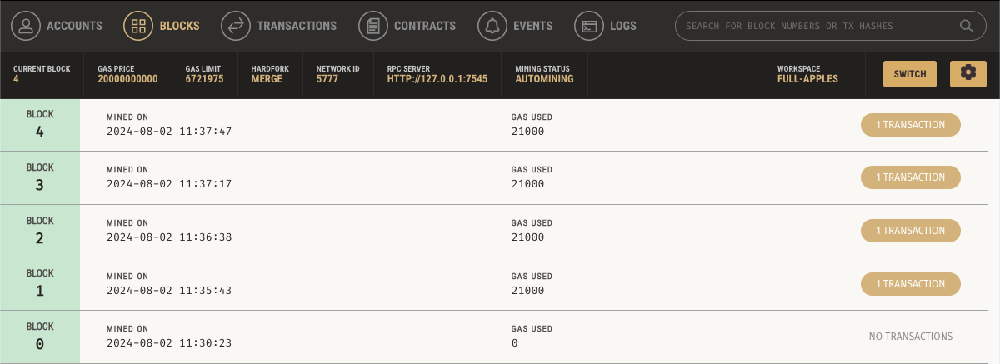

# KryptoJobs2Go!

## Project Overview

KryptoJobs2Go is a decentralized application that allows clients to hire fintech professionals and pay them using Ethereum. The application is built using Python and utilizes the Streamlit library for the frontend and Ganache as a local blockchain for testing transactions. The project demonstrates key blockchain concepts such as wallet creation, Ethereum transactions, and smart contract interactions.

## Table of Contents

1. [Project Overview](#project-overview)
2. [Code Explanation](#code-explanation)
   - [Wallet Generation](#wallet-generation)
   - [Transaction Functions](#transaction-functions)
3. [Streamlit Application](#streamlit-application)
   - [User Interface](#user-interface)
   - [Key Features](#key-features)
4. [Ganache Integration](#ganache-integration)
   - [Setup and Connection](#setup-and-connection)
   - [Block and Transaction Details](#block-and-transaction-details)
5. [Running the Project](#running-the-project)
6. [Conclusion](#conclusion)

## Code Explanation

### Wallet Generation

The wallet is generated using a mnemonic seed phrase to create an Ethereum account. This includes importing necessary libraries, fetching environment variables, and creating a Wallet object to derive a private key.

### Transaction Functions

The transaction functions allow for sending Ether between accounts on the Ethereum blockchain. They handle balance checking, gas estimation, transaction signing, and sending.

```python
# Example of transaction function
def send_transaction(w3, account, to, wage):
    """Send an authorized transaction to the Ganache blockchain."""
    # Set gas price strategy
    w3.eth.set_gas_price_strategy(medium_gas_price_strategy)

    # Convert eth amount to Wei
    value = w3.toWei(wage, "ether")

    # Calculate gas estimate
    gas_estimate = w3.eth.estimate_gas(
        {"to": to, "from": account.address, "value": value}
    )

    # Construct a raw transaction
    raw_tx = {
        "to": to,
        "from": account.address,
        "value": value,
        "gas": gas_estimate,
        "gasPrice": w3.eth.generate_gas_price(),
        "nonce": w3.eth.get_transaction_count(account.address),
    }

    # Sign the raw transaction with the Ethereum account
    signed_tx = account.sign_transaction(raw_tx)

    # Send the signed transactions
    return w3.eth.send_raw_transaction(signed_tx.rawTransaction)
```

## Streamlit Application

### User Interface

The Streamlit application provides an easy-to-use interface for interacting with the KryptoJobs2Go platform. Users can select candidates, input hours worked, and execute payments.


### Key Features

- **Candidate Selection:** Choose a candidate to hire.
- **Transaction Execution:** Send Ethereum payments.
- **Live Updates:** Display balance and transaction details.

### Example Screenshots

- **Home View:** 
- **Transaction Lane:** 
- **Transaction Ash:** 
- **Transaction Jo:** 
- **Transaction Kendall:** 

### Ganache Integration

#### Setup and Connection

Ganache is a personal blockchain for Ethereum development that you can use to deploy contracts, develop applications, and run tests. It provides a simple way to simulate blockchain networks for development purposes.

- **Ganache Home View:** 

### Block and Transaction Details

Ganache allows you to view block and transaction details, including gas usage and transaction hashes.

- **Block Overview:** 
- **Transaction Overview:** 
- **Value Transfer:** 

### Running the Project

1. **Setup Ganache:** Load the Ganache workspace and ensure accounts are funded with test Ether.

2. **Run `ganache_test.py`:** Confirm the connection to Ganache by executing the following command in the terminal/bash:

    ```bash
    python ganache_test.py
    ```

    - **Ganache Test Printout:**  
      

3. **Start Streamlit Application:** Launch the Streamlit app to interact with KryptoJobs2Go.

    ```bash
    streamlit run krypto_jobs.py
    ```

    - **Streamlit App Printout:**  
      

4. Execute Transactions: Use the Streamlit app to select candidates and send transactions. Verify transactions in Ganache.

5. Check Ganache: View transactions in the Ganache interface to ensure the correct execution of payments.
   
   - **Balance Overview:** 
   - **Block Details:** 
   - **Transaction Details:** 

## Conclusion

This project demonstrates the potential of blockchain technology in streamlining the hiring and payment processes in a decentralized environment. Through KryptoJobs2Go, we explored several key concepts:

- **Blockchain Integration:** Leveraging Ethereum and Ganache to execute secure and transparent transactions.
- **User-Friendly Interface:** Utilizing Streamlit to create an intuitive and interactive user experience.
- **Smart Contract Interactions:** Demonstrating the ability to programmatically handle transactions and manage user accounts.

### Afterthoughts and Discoveries

Throughout the development of KryptoJobs2Go, several insights and discoveries emerged:

- **Scalability Considerations:** While this project successfully demonstrates core blockchain concepts, scaling such a solution to handle larger volumes of transactions would require further optimization and potentially alternative blockchain platforms or layer 2 solutions.
- **Security Implications:** Ensuring the security of blockchain applications is crucial, particularly when handling sensitive information and financial transactions. Future enhancements could focus on implementing more robust security features.
- **User Experience:** The integration of Streamlit proved to be an effective method for creating a user-friendly interface, though exploring additional UX/UI enhancements could further improve user interaction.
- **Educational Value:** This project served as an excellent introduction to Ethereum, smart contracts, and decentralized applications, providing valuable hands-on experience with blockchain development tools.

In conclusion, KryptoJobs2Go illustrates the powerful capabilities of blockchain technology in creating decentralized solutions. As blockchain continues to evolve, there are vast opportunities for further exploration and innovation in this space.

## Author

Alexandr Climenco